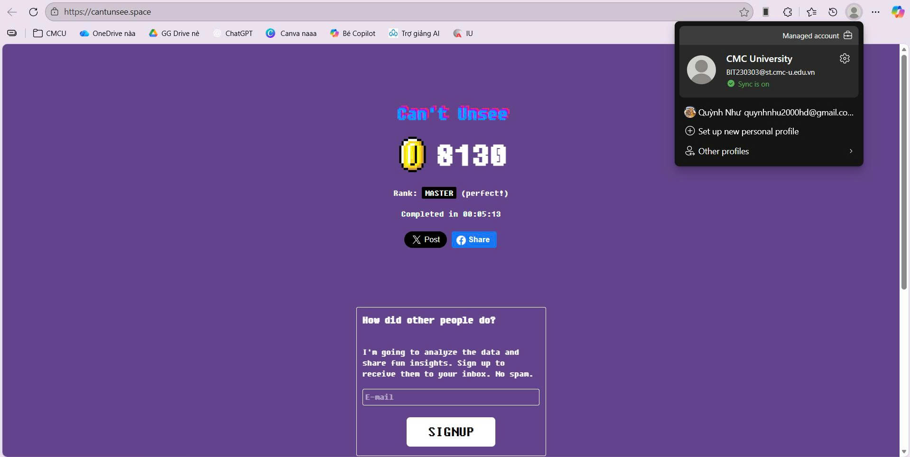

# Software Testing Practice

**Sinh viên:** Nguyễn Quỳnh Như  
**Mã sinh viên:** BIT230303  

Repository này được sử dụng để lưu trữ và báo cáo kết quả thực hành môn **Kiểm thử phần mềm**, bao gồm việc học tập với NotebookLM và các bài tập thực hành sử dụng công cụ kiểm thử trong suốt học phần.

## Bài tập thực hành tuần 1
- Trải nghiệm đánh giá chất lượng giao diện tại https://cantunsee.space/
- Lưu trữ kết quả thực hành trên GitHub

